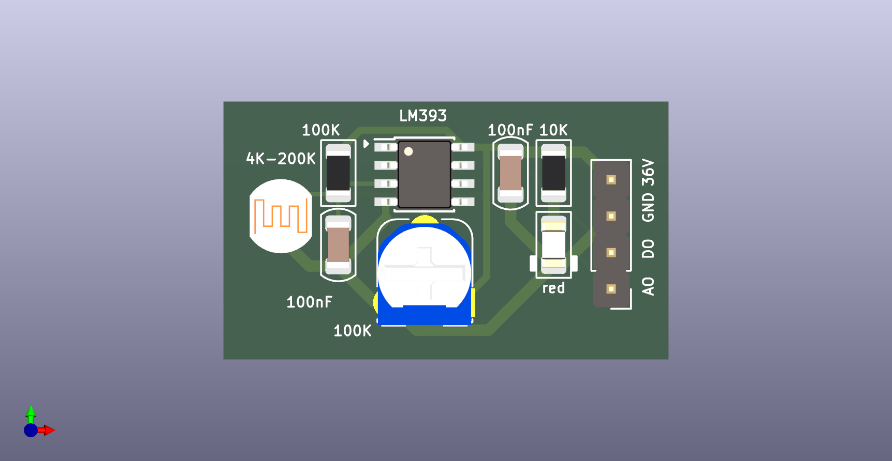

# photoresistor

   
  

模块参考
https://item.taobao.com/item.htm?id=39878225784&spm=a21wu.12321156.0.0.6f06584cNpolGY

比较器 LM393  
https://www.jlc-smt.com/lcsc/detail?componentCode=C400839  
VIN 2V~36V  

可调电阻  RM065-103(10K)  
https://www.jlc-smt.com/lcsc/detail?componentCode=C5205021  

光敏电阻 GL5506（4-7K）  
https://www.jlc-smt.com/lcsc/detail?componentCode=C11299  
暗电阻500K,亮电阻4K,p=3mm